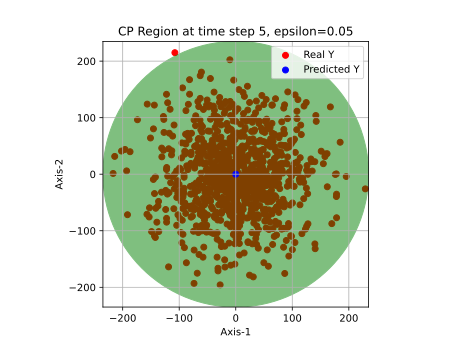

# Optimal Selection Conformal Prediction (OSCP) [[Paper]](https://arxiv.org/abs/2511.02103)
Implementation of the method OSCP. This work has been accepted for presentation at the European Control Conference (ECC) 2026.

OSCP addresses error quantification in multi-dimensional time-series predictions using conformal prediction, with the focus on multiple time-series case (i.e., input: **multiple i.i.d. time-series data**) and providing joint-in-time probabilistic guarantee. The resulting confidence regions are norm-balls (e.g., $l_2$ balls, $l_1$ cubes, ellipsoids, etc.).

---

## Citation
```
@article{pang2025efficient,
  title={Efficient Quantification of Time-Series Prediction Error: Optimal Selection Conformal Prediction},
  author={Pang, Boyu and Margellos, Kostas},
  journal={arXiv preprint arXiv:2511.02103},
  year={2025}
}
```
## Installation

**Requirements**
- Python >= 3.13.9
- **Gurobi Optimizer**
- Install Python packages: `pip install -r requirements.txt`


### Gurobi Optimizer (license needed)

Academic users can obtain a [**free academic license**](https://www.gurobi.com/academia/academic-program-and-licenses/). Then download [**Gurobi**](https://www.gurobi.com/downloads/gurobi-software/). 

Once installed, activate license key (or copy the file gurobi.lic to the main directory):

```
grbgetkey xxxxxxxx-xxxx-xxxx-xxxx-xxxxxxxxxxxx
```

## Usage Example

**Create new OSCP object** (automatically executes the OSCP algorithm):
```
oscp = OSCP(pred_Y, real_Y, norm=2, tolerance=0.05, split_ratio=0.5, optTimeLimit=1000)
```

**Typical Usage**:
```
print("Radii of the CP-regions: ", oscp.cp_radii) # CP regions are in norm-ball shapes
print("Real Y values at all time-steps lie within CP-regions of the predicted Y: ", oscp.is_in_cp_region(pred_Y_test, real_Y_test)) 
print("Empirical coverage on test-set: ", oscp.emp_coverage(pred_Y_test, real_Y_test))
```
The output above:
```
Radii of the CP-regions: [204.71043918 246.8841168 ... 235.55333146]
Real Y values at all time-steps lie within CP-regions of the predicted Y: [True True ... False]
Empirical coverage on test-set: 0.973
```
**Visualization**: 
```
# Visualization currently only supports d=2 and norm=2
oscp.visualize_2D_circular_conformal_region(pred_Y_test, real_Y_test, 5) # visualize CP region at t = 5 (starts at 0)
```
<p align="center">
  
</p>
